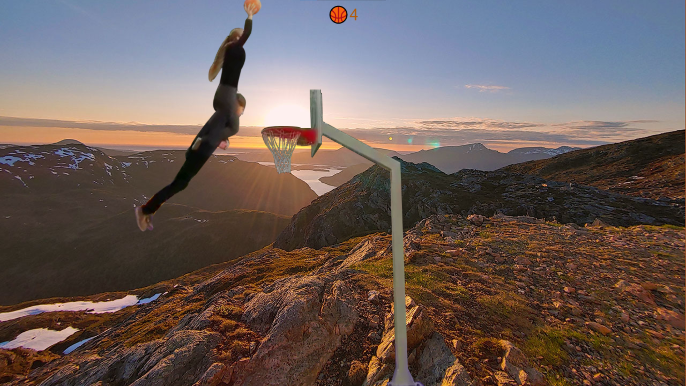

# BasketFall

## Gameplay

The game is currently hosted [here](http://folk.ntnu.no/larsmse/Random/BasketFall/).

This is a very simple browser-game about scoring in basketball and not falling. Tips:

* All velocity is preserved, so fine-tune your aim by turning the player whilst shooting.
* To stay alive, you have to have some part of the player on-screen, meaning that turning towards the center can save
  you in a pinch.
* Letting the ball go is generally easier than shooting, though much less fun.
* Beware the dreaded super-jump! The jumping distance is unpredictable, so an extreme angle is inherently deadly.

## Controls  
The controls are eloquently explained in emoji for optimal internationalization, though a translation appears below for
those not skilled in guessing:

*Title page with controls*

| Control-emoji | Control meaning | Action-emoji | Action meaning                   |
| :-----------: | --------------- | :----------: | -------------------------------- |
| ◀            | Left arrow key  | ↪            | Turn counter-clockwise           |
| ▶            | Right arrow key | ↩            | Turn clockwise                   |
| ↩            | Enter-key       | 🆗            | Accept                           |
| E             | E-key           | ⚓            | Drop ball straight down (let go) |
| 🌌            | Space-key       | 🤾‍♂️          | Shoot ball                       |
| B             | B-key           | 🗺           | Change map                       |

The game can also be played using a touch screen or mouse by using the four differently-colored defined touch zones
indicated by dashed lines, with one action-emoji corresponding to each. For example, pressing the upper middle part of
the screen shoots the ball (🤾‍♂️). When the game is not running, any press is the same as the 🆗-action.

For full-screen, press the 🎬-icon. (To convince the browser, you might have to press twice.)

*Not affiliated with [basketfall.com](https://basketfall.com/)*  